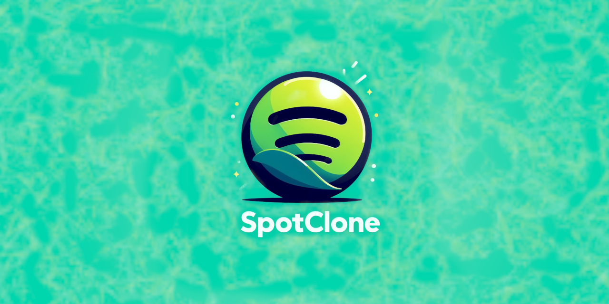

# 🎵 SpotClone 🎵


<p align="center">


</p>

## 📝 Sobre o Projeto

"SpotClone" é um clone da página web do [Spotify](https://open.spotify.com/intl-pt) criado durante a primeira #ImersãoFrontEnd e #Alura. O objetivo deste projeto é estudar e aprimorar minhas habilidades em desenvolvimento front-end.

## 💻 Tecnologias Utilizadas

- **HTML5**: Utilizado para a estruturação do site.
- **CSS3**: Usado para estilizar os componentes, criar layouts responsivos e animações.
- **JavaScript**: Utilizado para adicionar interatividade ao site, manipulando elementos HTML e CSS.

## 📋 Pré-requisitos

Antes de começar, você vai precisar ter instalado em sua máquina as seguintes ferramentas:
- [Node.js](https://nodejs.org/en/download/) que vem com o [npm](https://www.npmjs.com/get-npm) (Node Package Manager).

### 📥 Instalação do JSON Server

Este projeto utiliza o `json-server@0.17.4` para simular uma API REST. Para instalar o `json-server`, você precisará executar o seguinte comando no terminal:

```bash
npm install -g json-server@0.17.4
```

O `json-server` é essencial para o funcionamento da barra de busca durante a execução do projeto.

Após executar este comando, o `json-server` irá iniciar um servidor na porta 3000 e você poderá realizar requisições GET para `http://localhost:3000/artists` para buscar os artistas.

## 🚀 Como Executar o Projeto

1. Clone o repositório
```bash
git clone https://github.com/seuusuario/SpotClone.git
```

2. Inicie a simulação da API
```bash
json-server --watch api-artists/artists.json --port 3000
```

3. Abra o arquivo `index.html` no seu navegador de preferência.

## 🎭 Simulação de API com JSON Server

Para simular uma API de busca de artistas, este projeto utiliza o `json-server@0.17.4`. O `json-server` é uma ferramenta que permite criar uma API REST falsa para desenvolvimento e prototipagem.

O arquivo `api-artists/artists.json` contém os dados dos artistas que são retornados quando uma busca é realizada na barra de busca do SpotClone.

Para iniciar a simulação da API, execute o seguinte comando no terminal:

```bash
json-server --watch api-artists/artists.json --port 3000
```

## 🌐 Hospedagem no GitHub Pages

Este projeto está hospedado no GitHub Pages e pode ser acessado através do seguinte link: SpotClone.

No entanto, é importante notar que a funcionalidade de busca não funcionará na versão hospedada no GitHub Pages. Isso ocorre porque o GitHub Pages é uma hospedagem de página estática e não suporta a execução do `json-server` necessário para a simulação da API de busca de artistas.

Para experimentar a funcionalidade de busca, você precisará clonar o repositório e executar o projeto localmente conforme descrito na seção "Como Executar o Projeto".

## 📄 Licença

[MIT License](https://github.com/ISS2718/SpotClone/blob/main/LICENSE) © [Isaac Santos Soares](https://github.com/ISS2718).